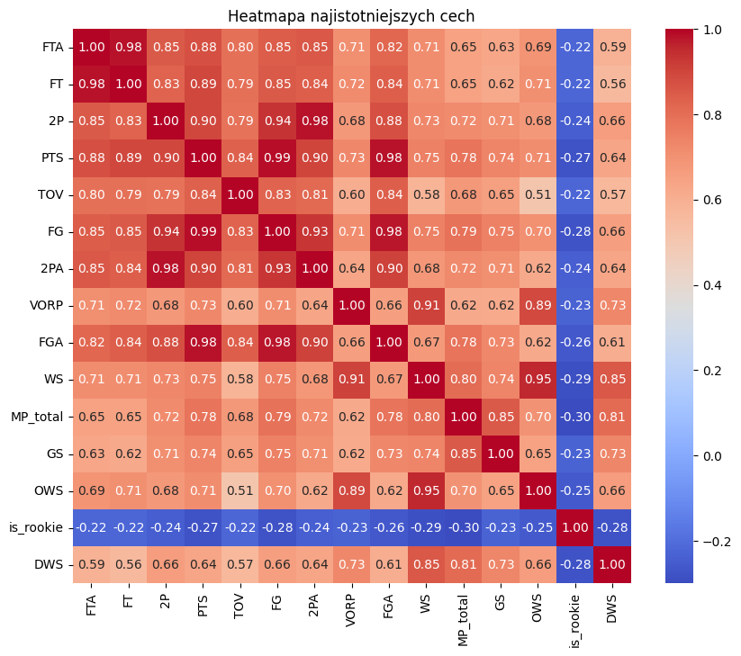
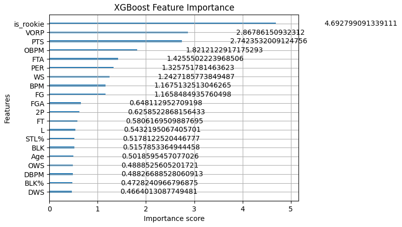

# 1. Analiza korelacji cech
Kod testowy znajduje się w pliku jupyter notebook `feature_engineering.ipynb` w sekcji **Correlation**.

W ramach inżynierii cech przeprowadzono analizę korelacji między zmiennymi liczbowymi a zmienną docelową `target`. Na podstawie współczynnika korelacji wybrano 15 cech najbardziej skorelowanych z klasą target. Dla tego podzbioru wygenerowano heatmapę, aby ocenić siłę i kierunek zależności między cechami oraz wykryć redundancje.





Taka analiza pozwala lepiej zrozumieć strukturę danych i może wspomagać dalsze etapy selekcji cech, tworzenia nowych zmiennych lub zastosowania technik redukcji wymiarowości.

Z powyżej analizy wynika że:
* Bardzo silne zależności : 
    * 2P, 2PA, FG, PTS, FGA, PTS, FTA, FT

    * WS, OWS, VORP
    * MP_total, GS 

* Rookie ma ujemne korelacje z większością zaawansowanych metryk (np. WS, MP_total, PTS) 

# 2. Feature importance



Powyższy wykres przedstawia ważność cech `(feature importance)` obliczoną przez model `XGBoost`. Wartości te wskazują, jak bardzo dana cecha wpływała na podejmowanie decyzji przez model podczas treningu.

 * Model silnie opiera swoje decyzje na zaawansowanych metrykach efektywności gracza (np. VORP, OBPM, PER).

 * Informacja o tym, czy gracz jest debiutantem (is_rookie), ma ogromne znaczenie klasyfikacyjne, co pokazuje skuteczność osobnego traktowania All-Rookie w modelu.

* Wizualizacja ta pomaga zrozumieć, które cechy warto zachować lub wzmocnić, a które mogą mieć mniejszy wpływ i mogą być ewentualnie usunięte w analizie selekcji cech.


# 3. PCA

Kod testowy znajduje się w pliku jupyter notebook `feature_engineering.ipynb` w sekcji **PCA**.

Aby poprawić reprezentację danych i ograniczyć redundancję informacji, zastosowano **PCA (Principal Component Analysis)** – metodę redukcji wymiarowości.

Proces został podzielony na kilka etapów:

- **PCA wynikające z korelacji**:  
  - `PC_rzuty_all`: 7 cech rzutowych (np. FGA, FT, PTS),
  - `PC_impact`: metryki wpływu (np. VORP, WS),
  - `PC_minutes`: dane o czasie gry (MP_total, GS).  
  Każdy blok został zredukowany do jednej składowej głównej, zachowując większość informacji.

- **PCA na wybranych cechach z mutual information**:  
  Wykorzystano `mutual_info_classif` do identyfikacji nowych istotnych cech spoza już używanego zbioru. Spośród pozostałych cech wybrano tylko te, dla których `MI > 0.01 — ustalony próg istotności`, aby odrzucić cechy o marginalnej użyteczności predykcyjnej. Następnie wykonano PCA na tej grupie, zachowując **90% wariancji**, co dało dodatkowe składowe `PC_rest_X`.

    Zdecydowano się na użycie **`mutual_info_classif`** do oceny ważności cech względem zmiennej docelowej `target`, ponieważ:

    - Pozwala wykryć **zależności nieliniowe**, które często występują w rzeczywistych danych,
    - Nie wymaga założeń o rozkładzie normalnym ani o jednorodności wariancji klas,
    - Może obsługiwać zarówno cechy ciągłe, jak i dyskretne.


- **Zachowanie wybranych oryginalnych cech**:  
  Część kluczowych zmiennych (np. `is_rookie`, `BPM`, `potw_count`) została dołączona w oryginalnej postaci, ponieważ zawierały istotne informacje (Feature importance test) i nie były skorelowane z innymi cechami.

- **Scalenie i zapis**:  
  Wszystkie przekształcone oraz wybrane cechy połączono w finalny zbiór `X_final`, który zapisano do pliku `nba_dataset_PCA_2010_2025.csv`.

To podejście powinno pozwolić na redukcję szumu, lepszą generalizację modelu oraz zwiększenie wydajności obliczeniowej przy zachowaniu kluczowych informacji zawartych w danych.

## Uzyskany score:
```
Total score: 290/450
first all-nba team: 66 points
second all-nba team: 56 points
third all-nba team: 56 points
first rookie all-nba team: 56 points
second rookie all-nba team: 56 points
```
PCA nie sprawiło że wynik klasyfikacyjny był lepszy i znacząco odstawał od innych.


#  Feature Selection: `SelectFromModel` z XGBoost

Kod testowy znajduje się w pliku jupyter notebook `feature_engineering.ipynb` w sekcji **Select From Model - Cascade Model, XGB - Params Tuning**.

W ramach etapu klasyfikacji wieloklasowej (etap 2) zastosowano automatyczną selekcję cech przy użyciu metody **`SelectFromModel`** na bazie wytrenowanego modelu `XGBoostClassifier`.

## Jak działa ten proces:

- Najpierw trenowany jest osobny model XGBoost na pełnym zestawie cech (`X_train_stage2`),
- Wagi (feature importance) przypisane przez model są podstawą selekcji,
- `SelectFromModel` automatycznie wybiera tylko te cechy, których ważność przekracza **próg średni (`threshold="mean"`)**.

```python
selector = SelectFromModel(model, threshold="mean", prefit=True)
X_selected = selector.transform(X)
```

## Cel:
- Usunięcie cech o niskim znaczeniu predykcyjnym,
- Zmniejszenie wymiarowości i ryzyka nadmiernego dopasowania,
- Zwiększenie interpretowalności i wydajności modelu końcowego.

---

## Rezultat:
- Powstał nowy podzbiór danych zawierający tylko cechy wybrane przez model (`X_train_stage2_selected`),
- Na tych danych trenowany został finalny model XGBoost, którego predykcje posłużyły do budowy drużyn All-NBA i All-Rookie.

To podejście opiera się na idei, że **model najlepiej wie, które cechy są dla niego informacyjne** — i właśnie na ich podstawie powinien pracować przy klasyfikacji.

## Uzyskany score:
```
Total score: 328/450
first all-nba team: 68 points
second all-nba team: 56 points
third all-nba team: 68 points
first rookie all-nba team: 68 points
second rookie all-nba team: 68 points
```
Uzyskany score jest jednym z lepszych wyników. Architektura modelu składała się z kaskady modeli XGB. Zmiana typu progu na mediane pogorszyła wynik klasyfikacji.

---

#  Feature Selection: `Boruta`

Kod testowy znajduje się w pliku jupyter notebook `feature_engineering.ipynb` w sekcji **Boruta Random Forest in second stage, first stage XGB**.

Ciekawą metodą jest Boruta, która  działa w pełni automatycznie — `nie wymaga ustawiania żadnego progu czy liczby cech do wybrania`. Selekcja opiera się na statystycznym porównaniu każdej cechy z jej losowym odpowiednikiem (tzw. shadow feature). `Tylko te zmienne, które wielokrotnie i istotnie przewyższają „losowy szum”`, zostają zakwalifikowane jako istotne. Dzięki temu samemu nie trzeba podejmować arbitralnych decyzji — to model samodzielnie wybiera zestaw najbardziej znaczących cech.

## Proces przebiegał w dwóch etapach:

Selekcja cech przy użyciu Boruty:

* Uruchomiono algorytm BorutaPy, który wewnętrznie trenował RandomForest i oceniał, które cechy znacząco przewyższają losowy szum,

* Dzięki temu określono podzbiór zmiennych wartych dalszego rozpatrzenia, bez konieczności ustawiania progów istotności – selekcja była w pełni automatyczna.

Trening końcowego modelu Random Forest:

* Na wyselekcjonowanych przez Borutę cechach przetrenowano nowy model RandomForestClassifier,

* Hiperparametry zostały dostrojone przy użyciu RandomizedSearchCV, obejmującego 50 losowych kombinacji,

Celem było uzyskanie jak najlepszej wersji modelu na zawężonym, informacyjnie bogatym zbiorze cech. 


## Uzyskany score
```
Total score: 328/450
first all-nba team: 68 points
second all-nba team: 56 points
third all-nba team: 68 points
first rookie all-nba team: 68 points
second rookie all-nba team: 68 points
```
Tak samo jak w przypadku Select From Model uzyskano score jeden z lepszych, co by świadczyło że uwzględnienie przy klasyfikacji wieloklasowej (2 etap w moim algorytmie) tylko cech istotnych dla modelu poprawia w jakimś stopniu efekt klasyfikacji. Dodatkowo warto dodać, że tutaj użyty był do klasyfikacji wieloklasowej Random Forest który w raporcie z testowania modeli w porówaniu z innymi uzyskał przeciętne wyniki. To dodatkowo pokazuje, że trening na zredukowanych cechach, najbardziej wpływowych na predycje danego modelu ma realistyczny wpływ na rezultat klasyfikacji.