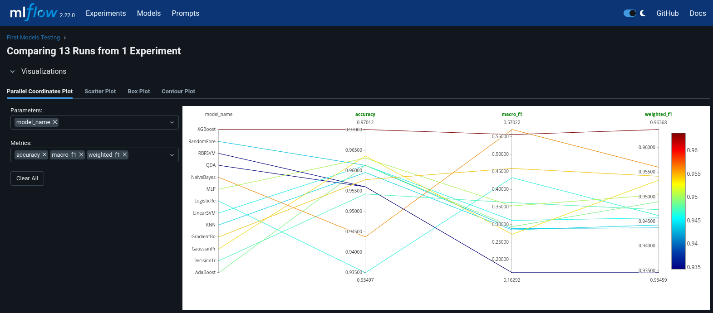
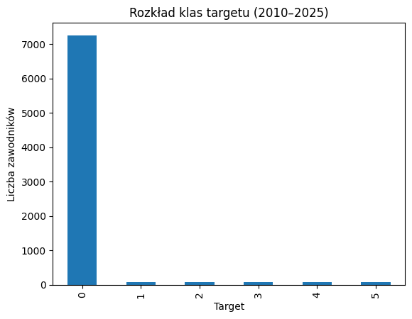
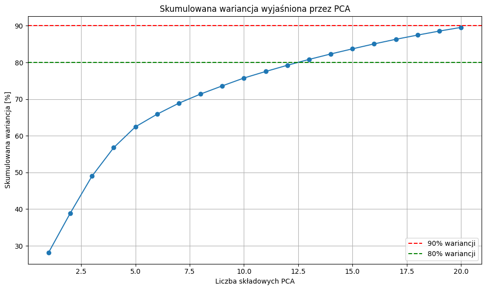

# Dobór zakresu sezonów branych pod uwagę przy trenowaniu
Cykl testowy obejmujący przyszłe testy będze realizowany na zbiorze danych obejmującym sezony `2010–2024 jako dane treningowe`, natomiast `sezon 2025 służy jako zestaw testowy` do końcowej oceny skuteczności modelu. Taki zakres został wybrany na początek ponieważ:
  * zapewnia średnią liczbę sezonów treningowych (15 sezonów), co pozwala modelowi lepiej zrozumieć schematy przyznawania nagród w różnych latach,
  * uwzględnia zmiany trendów w stylu gry NBA
  * zwiększa odporność modelu na sezonowe wahania
  * średnia liczba sezonów pozwala na szybsze iteracje, tuning hiperparametrów i testowanie różnych modeli 
  * przy zbyt dużych zbiorach występuje bardzo duża dysproporcja pomiędzy klasami


Po dokonaniu fazy testowej i sprawdzeniu wielu możliwości konfiguracyjnych modeli nastąpi sprawdzanie najlepszego modelu na innych możliwych zakresach zbioru uczącego.

# 1. Pierwsze testy modeli – porównanie bazowe

Aby ocenić skuteczność różnych klasyfikatorów w przewidywaniu przynależności zawodników do nagród sezonowych (All-NBA / All-Rookie), przeprowadzono porównawcze testy kilkunastu modeli klasyfikacyjnych. Wynik testów będzie optymalnym punktem startowym dla wyboru startowego klasyfikatora.

Kod testowy znajduje się w pliku jupyter notebook `models_creation.ipynb` w sekcji **Comparison of Different Models - Cross Validation**.

## 1.1 Cele testów:
- Sprawdzenie, które modele radzą sobie najlepiej na podstawie danych historycznych.
- Użycie **cross-sezonowej walidacji**: trenowanie na jednym sezonie, testowanie na kolejnym (np. 2018 → 2019).
- Pomiar metryk takich jak: `accuracy`, `macro F1`, `weighted F1`.

## 1.2 Logowanie do MLflow:
- Cały proces testowania został zintegrowany z **MLflow**, co umożliwia:
  - logowanie metryk (`accuracy`, `F1`),
  - zapisywanie parametrów modeli,
  - porównywanie wyników w jednym interfejsie.
- Logowanie można wyłączyć przez zmianę `log_to_mlflow = False`.

## 1.3 Testowane modele:
| Kategoria                | Modele                                                           |
|--------------------------|------------------------------------------------------------------|
| Drzewa i boosting        | `RandomForest`, `GradientBoosting`, `AdaBoost`, `DecisionTree`  |
| Regresja i liniowe       | `LogisticRegression`, `LinearSVM`                               |
| Sieci neuronowe          | `MLPClassifier`                                                  |
| Metody probabilistyczne  | `GaussianNB`, `QDA`, `GaussianProcess`                          |
| Inne                     | `KNN`, `RBFSVM`, *(opcjonalnie)* `XGBoost`                      |

Dla modeli wrażliwych na skalę danych, zastosowano preprocessing `StandardScaler` w ramach `Pipeline`.

```python
# Modele, które wymagają skalowania
needs_scaling = {"LinearSVM", "RBFSVM", "KNN", "MLP", "GaussianProcess", "LogisticRegression"}
```

## 1.4 Zakres danych:
- Użyto danych z sezonów **2010–2025**, 
- Dane załadowano z wcześniej utworzonego pliku: `nba_dataset_2010_2025.csv`.

## Procedura walidacji:
- Dla każdego modelu przeprowadzono pętlę:
  1. Trening na sezonie `t`
  2. Test na sezonie `t + 1`
  3. Zapis wyników (accuracy, F1) do `DataFrame` oraz logów MLflow


## 1.5 Wyniki:
- Zebrane do pliku CSV:  
  `testing_models_results/first_models_comparison_results.csv`
- Zawierają dokładność (`accuracy`), `macro_f1` i `weighted_f1` dla każdego modelu i pary sezonów.

## 1.6 Wnioski



**Accuracy nie jest wystarczające w tym problemie z powodu mocno niezbalansowanego zbioru danych.**



**Dlatego lepszymi miarami są `macro F1 i weighted F1`, które pozwalają ocenić rzeczywistą skuteczność modelu w przewidywaniu również rzadszych klas nagród.**


- `XGBoost` łączy bardzo wysokie accuracy z dobrym F1, co czyni go wszechstronnym i stabilnym modelem. Jest również bardzo dobrym wyjściem do następnych testów.

- `NaiveBayes` uzyskał najwyższy wynik macro F1 mimo jendego z niższych wyników accuracy.

- `GradientBoostingClassifier` również oferuje solidne wyniki, nieco niższe niż XGBoost.

```
Ten etap pozwolił zidentyfikować, które algorytmy oferują najlepszą stabilność międzysezonową oraz potencjał predykcyjny dla dalszych testów i tuningu.
Dalsze etapy będą oparte na modelu klasyfikatora XGBoost, dodatkowo trzeba rozpatrzeć kwestię zbalansowania datasetu.
```
---

# 2. Bazowy model predykcyjny – XGBoost

Po porównaniu wielu klasyfikatorów, do predykcji nagród sezonu 2024/2025 wybrano model **XGBoost**, który osiągał świetny balans pomiędzy `accuracy`, `weighted F1` i `macro F1`. Model jest dobrym punktem wyjściowym do dalszych testów.

Kod opisywanego procesu znajduje się w pliku jupyter notebook `models_creation.ipynb` w sekcji **XGB Params Tuning - RandomSearch** oraz **XGB Training and Prediction**.

Przed wykonaniem trenowania i predykcji, wykonano proces tuningu hiperparametrów modelu za pomocą `RandomSearchCV`.

## 2.1 Ustawione hiperparametry na podstawie wyniku RandomSearchCV:
```python
XGBClassifier(
    subsample=1.0,
    colsample_bytree=0.9,
    reg_lambda=5,
    reg_alpha=0,
    n_estimators=100,
    max_depth=5,
    learning_rate=0.01,
    gamma=1,
    eval_metric="mlogloss",
    random_state=42
)
```

Model został przetrenowany na danych z sezonów **2010–2024**, a następnie zastosowany do wygenerowania predykcji na sezon **2025**.

## 2.2 Dane wejściowe:
- `X_train`, `y_train` — dane ze wszystkich sezonów przed 2025.
- `X_pred` — dane z sezonu 2025.


## 2.3 Logowanie do MLflow:
- Model oraz jego hiperparametry mogły być opcjonalnie logowane do **MLflow** (`NBA Final Prediction 2025`).
- Logowane były:
  - hiperparametry modelu,
  - tagi (`model_type`, `prediction_season`),
  - gotowy model (`mlflow.sklearn.log_model`),
  - plik z wynikami JSON (`classification_result_2025.json`).

## 2.4 Format wyników:
Model przewiduje rozkład prawdopodobieństwa dla każdej klasy (`1`–`5`) i wybiera **top 5 zawodników** dla każdej z klas:

```json
{
  "first all-nba team": [...],
  "second all-nba team": [...],
  "third all-nba team": [...],
  "first rookie all-nba team": [...],
  "second rookie all-nba team": [...]
}
```

Zawodnicy są sortowani wg najwyższego prawdopodobieństwa bycia przypisanym do danej klasy.


## 2.5 Przebieg procesu trenowania i predykcji modelu

### Wczytanie danych:
```python
df_full = pd.read_csv("databases/nba_dataset_2010_2025.csv")
```
Zbiór zawiera statystyki graczy oraz etykiety (`target`) z sezonów 2010–2025.

---
### Podział na cechy i etykiety:
```python
X = df_full.drop(columns=["Player", "Team", "Pos", "season", "target"])
y = df_full["target"]
```
- `X` — dane wejściowe (wszystkie cechy numeryczne),
- `y` — etykieta klasy przypisana graczowi (1–5 lub 0).

---
### Usuwanie niepotrzebnych kolumn do trenowania

Podczas przygotowywania danych do trenowania modelu (`X`) usunięto kolumny:
```python
["Player", "Team", "Pos", "season", "target"]
```

#### `Player` – nazwa zawodnika
- Identyfikator tekstowy (string).
- Nie zawiera żadnej wartości predykcyjnej.
- Może prowadzić do błędów podczas uczenia modelu.
- Utrzymywany osobno tylko do generowania raportów końcowych (np. JSON).

#### `Team` – zespół
- Nie została zakodowana numerycznie, więc nie może być bezpośrednio użyta przez model.
- Informacja o zespole jest już pośrednio zawarta w statystykach drużynowych przypisanych do zawodnika.

#### `Pos` – pozycja zawodnika
- Również zmienna kategoryczna (np. PG, C, SF).
- Nie zakodowana – obecność surowych stringów w danych wejściowych zaburzy proces uczenia.
- Od sezonu 2024 nie jest ta cecha uwzględniana przy wyborze All-NBA

#### `season` – rok sezonu
- Informacja czasowa, pomocna w podziale danych (np. do predykcji sezonu 2025).
- Pozostawienie jej jako cechy wejściowej mogłoby doprowadzić do przeuczenia na wzorcach sezonowych.

#### `target` – etykieta klasy
- To **wartość, którą model ma przewidzieć**.
- Nie może znajdować się w `X`, gdyż byłoby to przeciek informacji (data leakage).
- Jest wyodrębniona jako zmienna `y`.

---

### Maski logiczne:
```python
mask_train = df_full["season"] < 2025
mask_pred = df_full["season"] == 2025
```
- `mask_train` — maska określająca które dane wykorzystane są do trenowania (sezony 2010–2024),
- `mask_pred` — maska określająca które dane są do predykcji (sezon 2025).

---
### Przygotowanie podzbiorów:
```python
X_train = X[mask_train]
y_train = y[mask_train]
X_pred = X[mask_pred]
```
Zbudowanie bazy do trenowania i predykcji modelu z wykorzystaniem stworzonych masek logicznych

---
### Dodatkowe informacje:
```python
players_pred = df_full[mask_pred]["Player"].reset_index(drop=True)
is_rookie = df_full[mask_pred]["is_rookie"].reset_index(drop=True)
```
- `players_pred` — lista zawodników (imię, nazwisko) z sezonu 2025,
- `is_rookie` — flaga (0 lub 1) określająca, czy gracz jest debiutantem (All-Rookie) .

---

### Trenowanie modelu
```python
model.fit(X_train, y_train)
```
Model `XGBoostClassifier` uczy się na danych z sezonów 2010–2024. Jego celem jest przypisanie każdemu zawodnikowi jednej z klas nagród:
- `1–3`: All-NBA Teams (First, Second, Third),
- `4–5`: All-Rookie Teams (First, Second),
- `0`: brak nagrody.

#### Predykcja prawdopodobieństw
```python
probas = model.predict_proba(X_pred)
```
Model przewiduje prawdopodobieństwa przynależności zawodników z sezonu 2025 do każdej klasy. Wynikiem jest macierz:
- Wiersze: zawodnicy,
- Kolumny: klasy (`0–5`),
- Wartości: prawdopodobieństwa.

#### Utworzenie tabeli wynikowej
```python
df_pred = pd.DataFrame(probas, columns=model.classes_)
```
- Tworzy nowy DataFrame tylko z kolumnami odpowiadającymi klasom (0–5).
- Każdy wiersz reprezentuje jednego zawodnika.

#### Uzupełnienie informacji kontekstowych
```python
df_pred["Player"] = players_pred
df_pred["is_rookie"] = is_rookie
```
- `Player`: dodaje imię i nazwisko zawodnika — potrzebne do wygenerowania czytelnych wyników,
- `is_rookie`: flaga przydatna do wybrania tylko debiutantów przy tworzeniu rankingów All-Rookie.

---

### Selekcja zawodników i zapis wyników do JSON

Po zakończeniu predykcji modelu, konieczne było wybranie zawodników do każdej z pięciu nagrodzonych drużyn i zapisanie ich do pliku w odpowiednim formacie.

#### Selekcja zawodników do drużyn nagrodzonych

Tworzony jest słownik `results`, który zawiera pięć kluczy odpowiadających wymaganym zespołom nagród:

```python
results = {
    "first all-nba team": df_pred.sort_values(1, ascending=False)["Player"].head(5).tolist(),
    "second all-nba team": df_pred.sort_values(2, ascending=False)["Player"].head(5).tolist(),
    "third all-nba team": df_pred.sort_values(3, ascending=False)["Player"].head(5).tolist(),
    "first rookie all-nba team": df_pred[df_pred["is_rookie"] == 1].sort_values(4, ascending=False)["Player"].head(5).tolist(),
    "second rookie all-nba team": df_pred[df_pred["is_rookie"] == 1].sort_values(5, ascending=False)["Player"].head(5).tolist()
}
```

- `sort_values(klasy)` – sortuje zawodników wg prawdopodobieństwa przypisania do danej klasy.
- `head(5)` – wybiera top 5 zawodników.
- `["Player"].tolist()` – konwertuje na listę nazwisk.
- Filtrowanie `is_rookie == 1` umożliwia selekcję tylko debiutantów do drużyn All-Rookie.

#### Zapis wyników do pliku `.json`

```python
with open("classification_result_2025.json", "w", encoding="utf-8") as f:
    json.dump(results, f, indent=2, ensure_ascii=False)
```

- Zapisuje strukturę `results` do pliku `classification_result_2025.json`.
- `indent=2` — formatowanie z wcięciami dla czytelności.
- `ensure_ascii=False` — umożliwia poprawny zapis nazwisk z polskimi i międzynarodowymi znakami.

----
## 2.6 Uzyskany wynik klasyfikacji modelu baseline
```
Total score: 256/450
- first all-nba team: 68 points
- second all-nba team: 56 points
- third all-nba team: 8 points
- first rookie all-nba team: 68 points
- second rookie all-nba team: 56 points
```
---

# 3. Zmiana sekcji odpowiedzialnej za selekcje zawodników do nagradzanych drużyn

W pierwotnej wersji kodu zdarzało się, że ci sami zawodnicy trafiali do więcej niż jednej nagradzanej drużyny, co:

- zakłócało prawidłową ocenę modelu,

- naruszało zasady przypisywania nagród (każdy zawodnik może być wyróżniony tylko raz).

Przyczyną problemu było wybieranie top 5 graczy z każdej klasy niezależnie, na podstawie najwyższego prawdopodobieństwa. Niektórzy zawodnicy uzyskiwali wysokie wyniki w kilku kategoriach jednocześnie, przez co zostali zakwalifikowani do więcej niż jednej drużyny.

---
## 3.1 Rozwiązanie: eliminacja powtórzeń podczas selekcji
Aby zapewnić, że każdy zawodnik zostanie przypisany do maksymalnie jednej drużyny, wprowadzono logikę eliminującą powtórzenia w trakcie wyboru kolejnych piątek, zachowując zasadę że, zawodnicy są wybierani w ustalonej kolejności klas (1 -> 2 -> 3 -> 4 -> 5) czyli najpierw cała klasa 1, potem 2 itd.

```python
 # === Budowanie piątek
    df_pred = pd.DataFrame(probas_stage2, columns=[inverse_class_map[i] for i in range(5)])
    df_pred["Player"] = players_stage2
    df_pred["is_rookie"] = is_rookie_stage2

    results = {}
    ordinal = ["first", "second", "third"]
    already_selected = set()

    for idx, class_id in enumerate([1, 2, 3]):
        available = df_pred[~df_pred["Player"].isin(already_selected)]
        top5 = available.sort_values(class_id, ascending=False).head(5)
        team_name = f"{ordinal[idx]} all-nba team"
        team_players = top5["Player"].tolist()
        results[team_name] = team_players
        already_selected.update(team_players)

    already_rookies = set()
    for idx, class_id in enumerate([4, 5]):
        available_rookies = df_pred[(df_pred["is_rookie"] == 1) & (~df_pred["Player"].isin(already_rookies))]
        top5 = available_rookies.sort_values(class_id, ascending=False).head(5)
        team_name = f"{ordinal[idx]} rookie all-nba team"
        team_players = top5["Player"].tolist()
        results[team_name] = team_players
```
---
## 3.2 Rozwiązanie: również eliminacja powtórzeń podczas selekcji ale zmiana procesu doboru do finalnych drużyn
W tym podejściu najpierw tworzony jest ranking ogólny zawodników All-NBA na podstawie sumy prawdopodobieństw bycia wybranym do którejkolwiek z trzech drużyn (klasy 1–3). Dzięki temu możliwe jest wytypowanie 15 graczy o najwyższym ogólnym potencjale.

Następnie, dla każdej z drużyn (First, Second, Third All-NBA) zawodnicy z top15 są sortowani według prawdopodobieństwa przypisania do danej klasy.

Podczas budowy finalnych składów, zawodnicy są wybierani w sposób sekwencyjny:

```sql
First → Second → Third → First → ...
```

Każdy gracz może zostać przypisany tylko do jednej drużyny – jeśli został już wybrany wcześniej, nie jest brany pod uwagę przy kolejnych selekcjach. Podobnie jest tworzona selekcja rookie ale tamtym przypadku nie tworzymy zbioru z sumą prawdopodobieństw.

```python
df_pred = pd.DataFrame(probas_stage2, columns=[inverse_class_map[i] for i in range(5)])
df_pred["Player"] = players_stage2
df_pred["is_rookie"] = is_rookie_stage2
df_pred["all_nba_score"] = df_pred[[1, 2, 3]].sum(axis=1)

top15 = df_pred.sort_values("all_nba_score", ascending=False).head(15).copy()
#print("Top 15 graczy sortowanych po all_nba_score:")
#print(top15[["Player", 1, "all_nba_score"]])

ranks = {
    "first all-nba team": top15.sort_values(1, ascending=False)["Player"].tolist(),
    "second all-nba team": top15.sort_values(2, ascending=False)["Player"].tolist(),
    "third all-nba team": top15.sort_values(3, ascending=False)["Player"].tolist()
}

results = {team: [] for team in ranks}
used_players = set()

while any(len(results[team]) < 5 for team in results):
    for team in ["first all-nba team", "second all-nba team", "third all-nba team"]:
        for player in ranks[team]:
            if player not in used_players:
                results[team].append(player)
                used_players.add(player)
                break

# === Rookie teams
rookies_df = df_pred[df_pred["is_rookie"] == 1].copy()
rookie_ranks = {
    "first rookie all-nba team": rookies_df.sort_values(4, ascending=False)["Player"].tolist(),
    "second rookie all-nba team": rookies_df.sort_values(5, ascending=False)["Player"].tolist()
}

results.update({team: [] for team in rookie_ranks})
used_rookies = set()


while any(len(results[team]) < 5 for team in rookie_ranks):
    for team in ["first rookie all-nba team", "second rookie all-nba team"]:
        for player in rookie_ranks[team]:
            if player not in used_rookies:
                results[team].append(player)
                used_rookies.add(player)
                break
```
---
# 4. Testy na zbalansowanym zbiorze danych

## 4.1 Próba własnego undersampligu
Kod opisywanego procesu znajduje się w pliku jupyter notebook `models_creation.ipynb` w sekcji **Class Balancing – Undersampling Dataset, XGB Training and Prediction**.

Aby przeciwdziałać dominacji klasy target = 0 (brak nagrody), zastosowano undersampling:
* Dane podzielono na zawodników nagrodzonych (target > 0) i nienagrodzonych (target = 0).
* Z klasy większościowej losowo pobrano 50% przykładów.
* Następnie połączono je z pełnym zbiorem klasy mniejszości.

Dzięki temu model trenuje na bardziej zrównoważonym zbiorze, co powinno poprawić jego zdolność do rozpoznawania rzadkich klas, natomiast uzyskany wynik klasyfikacji okazał się gorszy od trenowania na niezbalansowanym zbiorze.

```
Total score: 229/450
- first all-nba team: 68 points
- second all-nba team: 49 points
- third all-nba team: 8 points
- first rookie all-nba team: 48 points
- second rookie all-nba team: 56 points
```
---
## 4.2 Zastosowanie SMOTE (Synthetic Minority Over-sampling Technique)
Algorytm tworzy nowe, sztuczne przykłady dla klas mniejszościowych.Dla każdego przykładu z klasy rzadkiej wybiera kilku najbliższych sąsiadów (domyślnie 5), a następnie generuje nowe punkty cech, które znajdują się między nimi w przestrzeni wektorowej.

Dzięki temu zbiór danych zostaje zrównoważony, ale bez duplikowania istniejących rekordów, co zmniejsza ryzyko przeuczenia. SMOTE pozwala modelowi lepiej uczyć się wzorców w danych rzadkich klas. Zastosowanie tej metody nie poprawiło bazowego wyniku.

---
# 5. Cascade XGB Classifier
Kod opisywanego procesu znajduje się w pliku jupyter notebook `models_creation.ipynb` w sekcji **Cascade Model, XGB – Traning and Prediction**.

W tym rozwiązaniu zastosowano dwuetapowy `pipeline predykcyjny, który składa się z dwóch klasyfikatorów XGB`:

## Etap 1 – Klasyfikacja binarna (target > 0)
Najpierw model `XGBoost` uczy się rozróżniać zawodników, którzy otrzymają jakąkolwiek nagrodę (target > 0) od tych, którzy jej nie otrzymają (target = 0). Wykorzystano compute_sample_weight("balanced"), aby uwzględnić nierównowagę klas.

`compute_sample_weight` automatycznie oblicza wagę odwrotnie proporcjonalną do liczności danej klasy.

Klasa mniejszościowa otrzymuje wyższą wagę, klasa większościowa — niższą.Wagi są następnie przekazywane do modelu XGBoost podczas .fit(), aby wymusić bardziej sprawiedliwe traktowanie obu klas.

## Etap 2 – Klasyfikacja wieloklasowa (target 1–5)
Drugi model `XGBoost` jest trenowany tylko na przypadkach pozytywnych z etapu pierwszego. Przewiduje konkretną klasę nagrody (All-NBA lub All-Rookie), korzystając z podejścia multi:softprob.

Dla uzyskania lepszych wyników na obydwóch modelach przeprowadzono tuning hiperparametrów (RandomSearchCV).

Taka konstrukcja zanotowała bardzo dobry wynik klasyfikacyjny. Podejście to zwiększyło precyzje modelu dzięki wytypowaniu przez 1 model graczy którzy według niego mają szanse na nagrodę co zmniejszyło pole dopasowań dla drugiego modelu, który mógł sie skupić już na faktycznych kandydatach do danych nagród.
```
Total score: 316/450
- first all-nba team: 68 points
- second all-nba team: 56 points
- third all-nba team: 68 points
- first rookie all-nba team: 68 points
- second rookie all-nba team: 56 points
```

# 6. Testy na modelu Gradient Boosting Classifier 
Kod opisywanego procesu znajduje się w pliku jupyter notebook `models_creation.ipynb` w sekcjach poniżej **GBC Undersampling Params Tuning**. 

Podobne testy zostały przeprowadzone również z wykorzystaniem Gradient Boosting Classifier (GBC). Zastosowano zarówno wariant dwuetapowy (analogiczny do XGBoost), jak i prostsze podejście z pojedynczym modelem GBC trenowanym na danych oryginalnych oraz po zastosowaniu undersamplingu klasy dominującej. Wszystkie te przypadki generowały porównywalne wyniki do przypadków z modelem XGB.

# 7. Models Combining (Voting, Stacking)
Ponieważ podejście oparte na kaskadzie klasyfikatorów (binarna + wieloklasowa predykcja) dało najlepsze dotychczasowe wyniki, kolejne eksperymenty skupiają się na testowaniu metod łączenia modeli, takich jak Stacking i Voting. Celem jest sprawdzenie, czy połączenie różnych modeli przy etapie wieloklasowej predykcji będzie w stanie polepszyć wynik klasyfikacji.

## 7.1  Voting CLF (XGB, GBC, LR) 
Kod opisywanego procesu znajduje się w pliku jupyter notebook `models_combining.ipynb` w sekcji **Voting CLF (XGB, GBC, LR) Training and Evaluation**.

* Etap 1 – Klasyfikacja binarna

   Model XGBoost przewiduje, czy zawodnik otrzyma jakąkolwiek nagrodę (target > 0). Do treningu zastosowano compute_sample_weight("balanced"), by uwzględnić nierównowagę klas.

* Etap 2 – VotingClassifier dla zawodników pozytywnych

  Zawodnicy, którzy przeszli przez etap 1, są poddawani klasyfikacji wieloklasowej (nagrody 1–5) przy użyciu VotingClassifiera w trybie "soft". Składa się on z:

  * XGBoostClassifier (multi:softprob),

  * GradientBoostingClassifier,

  * StandardScaler + LogisticRegression (z balansem klas).

```
Total score: 276/450
- first all-nba team: 68 points
- second all-nba team: 49 points
- third all-nba team: 47 points
- first rookie all-nba team: 56 points
- second rookie all-nba team: 56 points
```
Podejście oparte na VotingClassifierze, czyli równoległej predykcji trzema różnymi modelami (XGBoost, GBC, Logistic Regression), dało wynik gorszy niż wcześniejsza kaskada XGB dwustopniowa. 

## 7.2 Stacking CLF (XGB, GBC) + LR 
Kod opisywanego procesu znajduje się w pliku jupyter notebook `models_combining.ipynb` w sekcji **Stacking CLF (XGB, GBC, LR) - Training and Evaluation**.

W tym podejściu wykorzystano dwustopniowy pipeline klasyfikacyjny, w którym końcową decyzję podejmuje StackingClassifier — model uczący się na wyjściach kilku bazowych klasyfikatorów.

* Etap 1 – Klasyfikacja binarna (target > 0)

  Model XGBoost przewiduje, czy dany zawodnik otrzyma jakąkolwiek nagrodę. Do treningu użyto compute_sample_weight("balanced"), by uwzględnić nierównowagę klas.

* Etap 2 – Klasyfikacja wieloklasowa przez stacking

  Dla zawodników zakwalifikowanych w etapie 1, tworzony jest model StackingClassifier, który:

  * Łączy dwa modele bazowe: XGBoost i GradientBoostingClassifier,

  * Jako model nadrzędny (meta-estymator) wykorzystuje: standaryzowaną regresję logistyczną (LogisticRegression + StandardScaler),

  * Używa predict_proba jako dane wejściowe dla warstwy finalnej (stack_method='predict_proba').


```python
# === Stacking model
xgb = XGBClassifier(objective="multi:softprob", num_class=5, use_label_encoder=False, eval_metric="mlogloss", random_state=42)
gbc = GradientBoostingClassifier(random_state=42)
logreg_pipe = make_pipeline(StandardScaler(), LogisticRegression(max_iter=1000, class_weight="balanced", multi_class="multinomial", solver="lbfgs", random_state=42))

stack = StackingClassifier(
    estimators=[("xgb", xgb), ("gbc", gbc)],
    final_estimator=logreg_pipe,
    stack_method="predict_proba",
    passthrough=False,
    cv=3,
    n_jobs=-1
)

```

Podejście to pozwala połączyć mocne strony wielu algorytmów (XGB, GBC, LogReg) i uzyskać bardziej zrównoważoną, odporną na nadmierne dopasowanie klasyfikację. Stacking umożliwia bardziej elastyczne modelowanie złożonych relacji między klasami nagród.

Po przeprowadzeniu RandomSearchCV i znalezieniu najbardziej optymalnych hiperparametrów modeli XGB, GBC, LR, udało się uzyskać najlepszy jak do tej pory wynik klasyfikacji. Selekcja do piątek odbyła się opisywanym algorytmem w podpunkcie 3.2.

```
Total score: 362/450
- first all-nba team: 90 points
- second all-nba team: 68 points
- third all-nba team: 68 points
- first rookie all-nba team: 68 points
- second rookie all-nba team: 68 points
```

## 7.3 Stacking CLF (XGB, GBC, NB) + LR
Kod opisywanego procesu znajduje się w pliku jupyter notebook `models_combining.ipynb` w sekcji **Stacking CLF (XGB + GBC + NB) Params Tuning and Prediction**.

W tej wersji zastosowano StackingClassifier z trzema bazowymi modelami: XGBoost, Gradient Boosting oraz Naive Bayes. Pomimo różnorodności algorytmów, podejście to uzyskało gorszy wynik niż wcześniejszy stacking oparty na XGB, GBC i Logistic Regression. Naive Bayes, jako model o wysokiej prostocie, prawdopodobnie osłabił jakość predykcji w roli modelu bazowego, pomimo że w wstępnym teście klasyfikatorów (punkt 1) odznaczał się największym `macro-f1`.

```
Total score: 307/450
first all-nba team: 68 points
second all-nba team: 56 points
third all-nba team: 47 points
first rookie all-nba team: 68 points
second rookie all-nba team: 68 points
```

## 7.4 Voting CLF [ Stacking Classifier (XGB, GBC) + LR; XGB solo]
Kod opisywanego procesu znajduje się w pliku jupyter notebook `models_combining.ipynb` w sekcji **Voting CLF with Stacking Classifier, XGB solo - Params Tuning, Prediction**.

To rozwiązanie wykorzystuje dwustopniową klasyfikację, w której:

* Etap 1: XGBoost klasyfikuje, czy zawodnik otrzyma jakąkolwiek nagrodę (target > 0) — model uwzględnia niezbalansowanie klas przy pomocy compute_sample_weight.

* Etap 2: na zawodnikach pozytywnych trenowany jest StackingClassifier, złożony z:

  * modeli bazowych: XGBoost, GradientBoostingClassifier,

  * meta-modelu: LogisticRegression (z StandardScaler),z użyciem predict_proba i cv=3.

Parametry stackingu są optymalizowane przez RandomizedSearchCV (50 iteracji, f1_macro).

Dodatkowo trenowany jest osobny XGBClassifier, a następnie obie predykcje są połączone w VotingClassifier (soft voting, wagi: stacking 2, XGB 1).

To podejście łączy automatyczne strojenie, stacking i ensembling, aby zwiększyć jakość klasyfikacji przy zachowaniu elastyczności i interpretowalności. Natomiast uzyskany wynik nie jest tak dobry jak algorytm z punktu 7.2, ale jest lepszy niż większość uzyskanych wyników.

```
Total score: 326/450
- first all-nba team: 68 points
- second all-nba team: 68 points
- third all-nba team: 54 points
- first rookie all-nba team: 68 points
- second rookie all-nba team: 68 points
```
---

# 8. Testowanie na innych zakresach sezonów
W celu oceny wpływu zakresu danych historycznych na skuteczność modeli, przetestowano różne konfiguracje sezonów treningowych:

* 2000–2024: bardzo długi przedział czasowy obejmujący ponad dwie dekady danych,

* 2017–2023: krótszy, bardziej aktualny zakres skupiony na współczesnym stylu gry,

* 2010–2024: zakres pośredni — obejmujący 15 sezonów o stabilnych trendach i reprezentatywnej liczbie przykładów.

## Wnioski
Spośród wszystkich testowanych opcji, najlepsze wyniki klasyfikacyjne uzyskano przy treningu na zbiorze 2010–2024. To podejście okazało się najbardziej zrównoważone pod względem:

* różnorodności danych (stylów gry i struktur drużyn),

* liczebności próbki,

* zachowania zgodności z aktualnymi schematami wyboru nagród.

Dzięki temu model miał wystarczająco dużo danych, by się uczyć, ale jednocześnie nie był obciążony przestarzałymi schematami z lat 2000–2010, które obecnie mają niewielką wartość prognostyczną.


# 9. Predykcja All-NBA i All-Rookie osobno

## Predykcja All-NBA
Kod opisywanego procesu znajduje się w pliku jupyter notebook `separated_models_testing/all_nba_clf.ipynb`.


### PCA
Przed rozpoczęciem redukcji wymiarowości i trenowaniem modelu do klasyfikacji graczy All-NBA, przeprowadzono wstępne czyszczenie danych.
Usunięto kolumny, które były istotne tylko w kontekście All-Rookie (is_rookie, rookie_of_month_count), a nie miały znaczenia przy klasyfikacji do drużyn All-NBA.

W ramach przygotowania do klasyfikacji All-NBA przeprowadzono analizę PCA na zestandaryzowanych danych wejściowych, aby zredukować wymiarowość i uchwycić najważniejsze źródła zmienności. Z analizy wynikało, że aby zachować 90% całkowitej wariancji danych, należy uwzględnić 20 głównych składowych. Umożliwiło to uproszczenie zbioru cech bez utraty istotnych informacji, przy jednoczesnym przyspieszeniu dalszego procesu predykcji.



### UMAP
Oprócz PCA, zastosowano również metodę UMAP (Uniform Manifold Approximation and Projection) w celu redukcji wymiarowości danych przed klasyfikacją All-NBA. UMAP pozwala na:
* zachowanie nieliniowych relacji między cechami, których PCA może nie uwzględniać,
* efektywną kompresję danych do przestrzeni o niższej liczbie wymiarów przy zachowaniu struktury klas.

### Wnioski
Choć metody redukcji wymiarowości takie jak PCA oraz UMAP pozwalają na uproszczenie przestrzeni cech i mogą poprawić wydajność obliczeniową, to w testach końcowych zbiory danych zredukwoane tymi metodami nie dawały optymalnych wyników podczxas testowania. A działanie tylko na surowych danych również nie dawało lepszych rezultatów od predykcji All-NBA i All-Rookie razem.

## Predykcja All-Rookie
Kod opisywanego procesu znajduje się w pliku jupyter notebook `separated_models_testing/all_rookie_clf.ipynb`.

Kroki podejmowane przy predykcji tej grupy były bardzo podobne do poprzednich i kończyły się takimi samymi wnioskami.


# 10. Podsumowanie testowania 

W ramach projektu przeprowadzono szeroką serię testów modeli klasyfikacyjnych mających na celu przewidywanie przynależności zawodników NBA do nagród sezonowych (All-NBA, All-Rookie). Testowano różne architektury, metody selekcji cech, techniki balansowania zbioru i redukcji wymiarowości.

Najważniejsze wnioski:
* `Najlepsze wyniki uzyskano przy zastosowaniu dwustopniowego pipeline'u klasyfikacyjnego`, w którym:

  * Etap 1: XGBoostClassifier klasyfikował binarnie, czy zawodnik otrzyma jakąkolwiek nagrodę,

  * Etap 2: StackingClassifier (XGB, GBC) + LogisticRegression przewidywał konkretną klasę nagrody,

  * Końcowa selekcja graczy eliminowała powtórzenia i zapewniała realistyczny dobór do drużyn.

* Zakres danych 2010–2024 jako treningowy i 2025 jako testowy okazał się najbardziej stabilnym i efektywnym zestawem, balansującym aktualność z reprezentatywnością.

* Metody balansowania klas (undersampling, SMOTE) nie przyniosły znacznej poprawy skuteczności, ale w moim przekonananiu były potrzebne więc finalnie implementowano `compute_sample_weight("balanced")`, aby uwzględnić nierównowagę klas

* Podejścia typu VotingClassifier okazały się mniej skuteczne niż stacking, mimo użycia tych samych modeli bazowych. Wyniki wskazują, że hierarchiczna organizacja predykcji (np. stacking) radzi sobie lepiej z problemem klasyfikacji złożonej.

* Redukcja wymiarowości przy użyciu PCA lub UMAP nie przyniosła poprawy wyników względem wcześniej przetworzonych danych (np. z PCA wyspecjalizowanym na grupach cech i manualnej selekcji).

* Podejście z rozdzieleniem klasyfikatorów dla All-NBA i All-Rookie testowano, lecz nie przyniosło lepszych wyników niż podejście łączone.

## Finalny wynik najlepszej wersji modelu:

```
Total score: 362 / 450
- first all-nba team: 90 points
- second all-nba team: 68 points
- third all-nba team: 68 points
- first rookie all-nba team: 68 points
- second rookie all-nba team: 68 points
```

Model ten bazował na pipeline:

* `XGB (binary)` ➝ `Stacking(XGB + GBC)` → `LogisticRegression`

## Dodatkowe wnioski

W rzeczywistości, tworząc system predykcyjny dla najnowszego sezonu, nie będe posiadać wyników `ground truth`  dla tego sezonu. W efekcie normalnie nie mógłbym sprawdzać wyników kalsyfikatorów na sezon 2025 ponieważ nie  posiadałbym dostępu do danych z sezonu 2025, w chwili wykonywania predykcji. Poza tym jak sama nazwa mówi jest to system predykcji ,więc finalnie nie powinniśmy wiedzieć jak wypadnie przygotowany przez nas model klasyfikacyjny. Dlatego też:

* Testowanie i porównywanie modeli powinno być oparte na danych historycznych — np. trenowanie na 2010–2023 i testowanie na 2024,

* Po zidentyfikowaniu najlepszego algorytmu (np. stacking), można przyjąć, że jego skuteczność powinna przenieść się na sezon 2025, zakładając podobne zależności w danych.

Dopiero po potwierdzeniu skuteczności modelu na roku 2024, pełny model może zostać dotrenowany z użyciem danych z 2025 (bez target), a następnie użyty do wykonania właściwej predykcji — której `wynik nie jest znany a priori`.


Uzyskany wynik wybranego algorytmu czyli 2 etapy klasyfikacji na rok 2024. Pokazuje ,że typ klasyfikatora jest poprawny 

### Test dla 2024 sezonu 

 Model:

* `XGB (binary)` ➝ `Stacking(XGB + GBC)` → `LogisticRegression`

Zakres danych:
* `2010-2023` trenowanie i  `2024` predykcja
 
 ```
Total score: 338/450
- first all-nba team: 90 points
- second all-nba team: 56 points
- third all-nba team: 56 points
- first rookie all-nba team: 68 points
- second rookie all-nba team: 68 points
```
Rezultat ten potwierdził, że wybrany model jest w stanie generalizować i trafnie wytypować drużyny w sezonie nieuczestniczącym w treningu, co stanowi solidne uzasadnienie do jego zastosowania w predykcji wyników na 2025 rok.